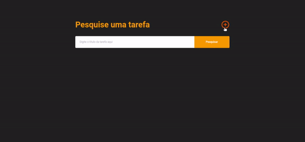

## Tecnologias utilizadas

  - Typescript
  - Node.js
  - ReactJS
  - Knex
  - SQLite3

## Como usar

> Clone o reposiório
```shell
$ git clone https://github.com/TakaGui/to-do-list.git
```
> Vá até o repositório
```shell
$ cd to-do-list
```
> Instale as dependências tanto na pasta Web quanto na pasta Server
```shell
$ npm install
```
ou
```shell
$ yarn
```
> Execute as migrations no server
```shell
$ npx knex:migrate
```
ou
```shell
$ yarn knex:migrate
```
> Execute o server
```shell
$ yarn dev:server
```

> Execute a web
> Execute o server
```shell
$ yarn start